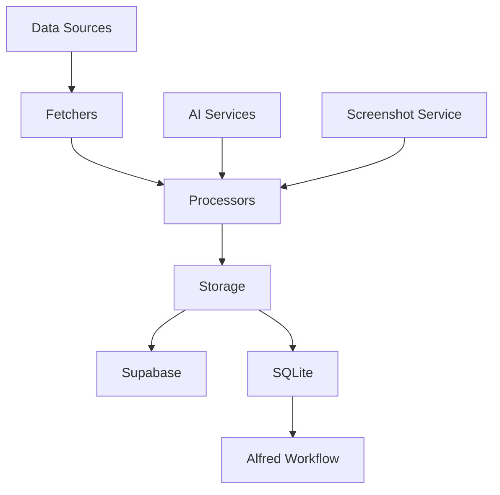
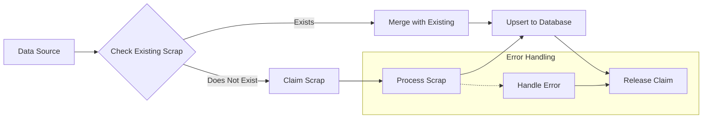
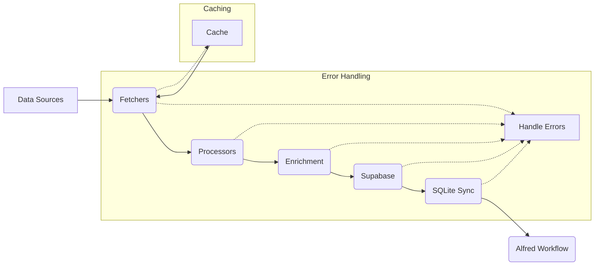

# Scrapbook Core

Scrapbook Core is a comprehensive data management system designed to accumulate and analyze digital ephemera from various sources. It serves as a personal knowledge management tool, capturing and organizing daily digital interactions across multiple platforms.


## Features

- Fetches data from multiple sources:
  - Pinboard bookmarks
  - Mastodon posts
  - GitHub activities (stars, issues, pull requests, gists)
  - Are.na blocks and channels
- Processes and stores data as "scraps" with unique IDs
- Generates summaries and extracts entities for easy retrieval
- Uploads screenshots to Supabase or Cloudinary and stores URLs
- Syncs data with both Supabase and SQLite databases
- Includes an Alfred Workflow for quick local database searches

Can be accessed through the command-line [scrapbook-cli](https://github.com/ejfox/scrapbook-cli) tool.

Also visible on [my website's scrapbook](https://ejfox.com/scrapbook/)

I also use it in combination with an Alfred Workflow and a local SQLite database for quick searching:
- `<scripts/setup_sqlite.mjs>`
- `<scripts/sync_supabase_to_sqlite.js>`
- `<scripts/search_sqlite_scraps.js>`
- `<Local Scrap Search.1.1.alfredworkflow.zip>`

## Cron Job Setup

The app is designed to run as a scheduled task using PM2's built-in cron feature. This ensures regular fetching and processing of data from all sources.

### Setting up with PM2

1. First, ensure PM2 is installed globally:
```bash
npm install -g pm2
```

2. Start the app with PM2:
```bash
pm2 start ecosystem.config.js --env production
```

This will:
- Start the app in production mode
- Schedule it to run every 4 hours (configurable in `ecosystem.config.js`)
- Manage logs automatically in the `logs` directory

### Monitoring and Management

Monitor the cron job:
```bash
pm2 logs scrapbook-core    # View logs
pm2 monit                  # Monitor execution
```

Manual control:
```bash
pm2 trigger scrapbook-core # Run manually (outside schedule)
pm2 stop scrapbook-core    # Stop the scheduled job
pm2 delete scrapbook-core  # Remove from PM2
```

### Logs

Logs are stored in the `logs` directory:
- `logs/out.log` - Standard output
- `logs/err.log` - Error logs

### Startup Configuration

To ensure the cron job persists across system restarts:

```bash
pm2 startup    # Generate startup script
pm2 save       # Save current PM2 configuration
```

### Customizing the Schedule

The cron schedule can be modified in `ecosystem.config.js`. The default schedule is every 4 hours (`0 */4 * * *`).

Common cron patterns:
- `0 */6 * * *` - Every 6 hours
- `0 0 * * *` - Once daily at midnight
- `0 */12 * * *` - Every 12 hours

## Deploying
`flyctl deploy`

### Running
`flyctl ssh console -C "node scripts/index.mjs --all"`

### Get logs
`flyctl logs`

## Database Schema

### Scraps table
```sql
CREATE TABLE public.scraps (
    id UUID NOT NULL DEFAULT gen_random_uuid(),
    source TEXT NOT NULL,
    content TEXT NOT NULL,
    summary TEXT NULL,
    created_at TIMESTAMP WITHOUT TIME ZONE NULL DEFAULT CURRENT_TIMESTAMP,
    updated_at TIMESTAMP WITHOUT TIME ZONE NULL DEFAULT CURRENT_TIMESTAMP,
    tags TEXT[],
    relationships JSONB NULL,
    metadata JSONB NULL,
    scrap_id TEXT NULL,
    embedding VECTOR NULL,
    title TEXT NULL,
    graph_imported BOOLEAN NULL DEFAULT FALSE,
    CONSTRAINT scraps_pkey PRIMARY KEY (id),
    CONSTRAINT scraps_id_key UNIQUE (id),
    CONSTRAINT scraps_scrap_id_key UNIQUE (scrap_id)
);
```


## System Architecture



## Key Components

1. **Data Fetchers**: Modules for each data source (e.g., `dl_pinboard.mjs`, `dl_mastodon.mjs`).  These modules handle the retrieval of data from external APIs.
2. **Processors**: Modules that process the raw data from the fetchers.  This includes:
   - `aiSummarization.js`: Generates summaries and tags using AI.
   - `aiGeolocation.mjs`: Extracts location data from text content.
   - `aiRelationshipExtraction.mjs`: Identifies relationships between different scraps.
3. **Storage**:  Handles persistence of processed data.
   - `index.mjs`: The main script orchestrating data fetching, processing, and storage in Supabase.
   - `sync_supabase_to_sqlite.js`: Synchronizes data between Supabase and a local SQLite database.
4. **Utilities**: Helper functions and modules.
   - `helpers.js`: Common utility functions.
   - `manifestHelpers.mjs`: Manages a manifest file for tracking data fetch operations.
5. **Alfred Workflow**: Enables quick searching of the local SQLite database.

## Files

- `index.mjs`: Main script orchestrating data flow.
- `sync_supabase_to_sqlite.js`: Syncs Supabase data to local SQLite.
- `aiSummarization.js`: AI-powered summarization and tag generation.
- `dl_pinboard.mjs`: Pinboard bookmark fetching and processing.
- `dl_mastodon.mjs`: Mastodon status retrieval and processing.
- `dl_arena.mjs`: Are.na block and channel fetching and processing.
- `dl_github.mjs`: GitHub data (repos, issues, PRs, gists) retrieval and processing.
- `aiGeolocation.mjs`: Location data extraction from text.
- `aiRelationshipExtraction.mjs`: Relationship identification between scraps.
- `helpers.js`: General utility functions.
- `manifestHelpers.mjs`: Manages data fetch manifests.
- `alfred_search.js`: Alfred Workflow search script.
- `Scrapbook Search.alfredworkflow`: Alfred Workflow (zip file).

## Setup

1. Clone the repository.
2. Install dependencies: `npm install`.
3. Set up environment variables (see "Setting Up Credentials" below).
4. Run the main script: `node index.mjs`.
5. Install the Alfred Workflow (unzip and double-click the `.alfredworkflow` file).

## Usage

- Fetch all data: `node index.mjs --all`
- Fetch specific sources: `node index.mjs --[source]` (e.g., `--pinboard`, `--mastodon`)
- Sync to SQLite: `node sync_supabase_to_sqlite.js`
- Search scraps using Alfred (keyword: `sc`).

### Maintenance Commands

The following commands help maintain the database by fixing or removing problematic scraps:

#### Cleaning Commands
- Delete scraps with missing data: `node index.mjs --clean`
- Delete only completely empty scraps: `node index.mjs --clean-empty`
- Delete scraps missing some fields: `node index.mjs --clean-partial`
- Preview what would be deleted: `node index.mjs --clean-dry-run`

#### Fixing Commands
- Fix missing data in scraps: `node index.mjs --fix`
- Preview what would be fixed: `node index.mjs --fix-dry-run`
- Fix specific issues:
  - Missing images: `node index.mjs --fix-images`
  - Missing embeddings: `node index.mjs --fix-embeddings`
  - Missing AI data: `node index.mjs --fix-ai`
- Fix specific sources:
  - Pinboard: `node index.mjs --fix-pinboard`
  - Are.na: `node index.mjs --fix-arena`
  - Mastodon: `node index.mjs --fix-mastodon`

All cleaning and fixing commands will:
1. Show you what will be affected before making changes
2. Display a breakdown by source
3. Show example scraps that will be modified
4. Ask for confirmation before proceeding

## Data Flow

1. Data is fetched from various sources.
2. Each item is processed: summaries are generated, locations and relationships are extracted, and screenshots are created (where applicable).
3. Processed data is upserted into Supabase.
4. Data is synced to a local SQLite database for offline access.
5. The local SQLite database can be searched quickly using the Alfred Workflow.

## Alfred Workflow

The Alfred Workflow enables quick searching of the local SQLite database.  It displays title, summary, and age, with quick actions to open URLs, view full content, or copy formatted scraps.

## Setting Up Credentials

This project requires several API keys and secrets.  Store these securely in a `.env` file *in your local repository only*.  **Do not commit your `.env` file to version control.**  Use the `.env-example` file as a template.

| Environment Variable        | Description                                                                     | Source                                                                          |
|-----------------------------|---------------------------------------------------------------------------------|-----------------------------------------------------------------------------------|
| `GITHUB_TOKEN`              | GitHub Personal Access Token (repo, read:user, gist scopes)                     | [GitHub Personal Access Tokens](https://github.com/settings/tokens)                 |
| `GITHUB_USERNAME`           | Your GitHub username                                                              |                                                                                   |
| `PINBOARD_TOKEN`            | Your Pinboard API token                                                            | [Pinboard Settings](https://pinboard.in/settings/password)                         |
| `ARENA_ACCESS_TOKEN`        | Your Are.na API token                                                             | [Are.na Developer Settings](https://dev.are.na/oauth/applications)                 |
| `USER_SLUG`                 | Your Are.na username                                                              |                                                                                   |
| `MASTODON_ACCESS_TOKEN`     | Your Mastodon API token                                                            | Your Mastodon instance's developer settings                                        |
| `MASTODON_API_URL`          | Your Mastodon instance URL (e.g., `https://mastodon.social`)                     | Your Mastodon instance's developer settings                                        |
| `SUPABASE_URL`              | Your Supabase project URL                                                         | Your Supabase project settings                                                    |
| `SUPABASE_KEY`              | Your Supabase anon key                                                            | Your Supabase project settings                                                    |
| `SUPABASE_SERVICE_ROLE_KEY` | Your Supabase service role key (required for database operations)               | Your Supabase project settings                                                    |
| `CLOUDINARY_CLOUD_NAME`     | Your Cloudinary cloud name                                                        | Your Cloudinary account settings                                                  |
| `CLOUDINARY_API_KEY`        | Your Cloudinary API key                                                           | Your Cloudinary account settings                                                  |
| `CLOUDINARY_API_SECRET`     | Your Cloudinary API secret                                                       | Your Cloudinary account settings                                                  |
| `OPENROUTER_API_KEY`        | OpenRouter API key (for AI summarization)                                      | OpenRouter account settings                                                       |
| `OPENCAGE_API_KEY`          | OpenCage Geocoding API key (for location extraction)                             | [OpenCage Data](https://opencagedata.com/)                                      |


## Rate Limiting and Caching

The application employs rate limiting using the `Bottleneck` library to avoid exceeding API limits.  Caching is used to reduce the number of API calls and improve performance.  The cache is stored locally in the `./data` directory.  A manifest file (`public/data/scrapbook/manifest.json`) tracks the last updated timestamp for each source.

## AI Services

The application utilizes AI services for tasks such as summarization and embedding generation.  Currently, OpenAI's `text-embedding-ada-002` model is used for embeddings.  The `OPENROUTER_API_KEY` is required for AI summarization.  Costs associated with these services are the responsibility of the user.

## Error Handling and Logging

The application includes comprehensive error handling and logging using `winston`. Errors are logged to the console, and detailed error messages are provided to aid in troubleshooting.

## Deployment (Fly.io)

This application is designed for deployment on Fly.io.  You will need a Fly.io account.  After setting up your environment variables, deploy using `flyctl deploy`.  The `fly.toml` file configures the application for multi-region deployment and health checks.

## Validation Tools

The project includes two validation utilities:

### Scrap Validation (`validate_scraps.mjs`)

This script validates the structure and content of scraped data, checking for missing fields, incorrect data types, and invalid formats.  It provides detailed error reporting and performance benchmarking.  Run it with `node scripts/validate_scraps.mjs [source]` (e.g., `node scripts/validate_scraps.mjs pinboard`).

### AI Service Validation (`validate_ai.mjs`)

This script tests the AI-powered features (summarization, geolocation, relationship extraction) using sample data.  Run it with `node scripts/validate_ai.mjs [test_name]` (e.g., `node scripts/validate_ai.mjs summarization`).

## Database Maintenance

Regularly run `node scripts/validate_db_integrity.mjs` to check for and clean up any orphaned or stuck processing records in the database.

## Claiming and Processing

The application uses a claiming mechanism to prevent multiple instances from processing the same data concurrently.  This ensures data consistency and avoids race conditions.  The claiming process is managed using Supabase's database capabilities.



## Overall Data Flow

This diagram illustrates the high-level data flow of the application.


