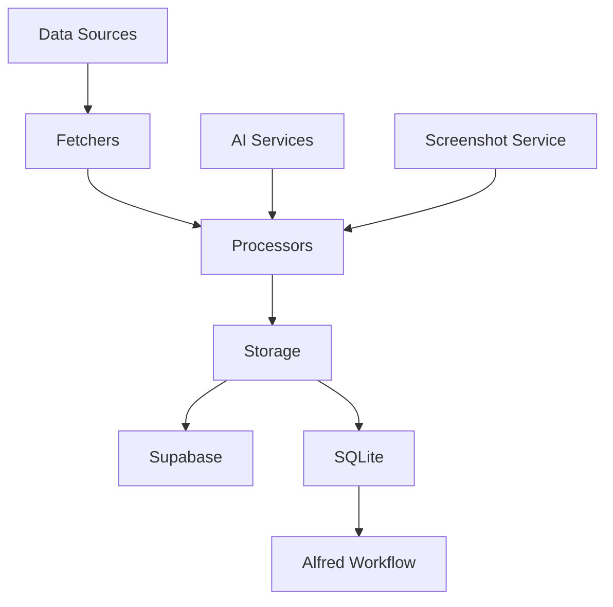

# Scrapbook Core

Scrapbook Core is a comprehensive data management system designed to accumulate and analyze digital ephemera from various sources. It serves as a personal knowledge management tool, capturing and organizing daily digital interactions across multiple platforms.

## Features

- Fetches data from multiple sources:
  - Pinboard bookmarks
  - Mastodon posts
  - GitHub activities (stars, issues, pull requests, gists)
  - Are.na blocks and channels
- Processes and stores data as "scraps" with unique IDs
- Generates summaries and extracts entities for easy retrieval
- Creates screenshots for visual reference
- Syncs data with both Supabase and SQLite databases
- Includes an Alfred Workflow for quick local database searches

## System Architecture



## Key Components

1. **Data Fetchers**: Modules for each data source (e.g., `dl_pinboard.mjs`, `dl_mastodon.mjs`)
2. **Processors**: 
   - `aiSummarization.js`: Generates summaries and tags
   - `aiGeolocation.mjs`: Extracts location data
   - `aiRelationshipExtraction.mjs`: Identifies relationships between scraps
3. **Storage**:
   - `index.mjs`: Main script for Supabase operations
   - `sync_supabase_to_sqlite.js`: Syncs data to local SQLite database
4. **Utilities**:
   - `helpers.js`: Common helper functions
   - `manifestHelpers.mjs`: Manages data fetch manifests
5. **Alfred Workflow**: Enables quick searching of the local SQLite database

## Files

- `index.mjs`: The main entry point of the application. It orchestrates the fetching, processing, and storage of data from all sources.
- `sync_supabase_to_sqlite.js`: Synchronizes data between Supabase and a local SQLite database.
- `aiSummarization.js`: Contains functions for summarizing content and generating tags using AI.
- `dl_pinboard.mjs`: Handles fetching and processing of Pinboard bookmarks.
- `dl_mastodon.mjs`: Manages the retrieval of Mastodon statuses.
- `dl_arena.mjs`: Fetches and processes Are.na blocks and channels.
- `dl_github.mjs`: Retrieves GitHub-related data (stars, issues, PRs, gists).
- `aiGeolocation.mjs`: Extracts location information from content.
- `aiRelationshipExtraction.mjs`: Identifies relationships between different pieces of content.
- `helpers.js`: Contains utility functions used across the project.
- `manifestHelpers.mjs`: Manages the manifest file for tracking data fetch operations.
- `alfred_search.js`: Script used by the Alfred Workflow to search the local SQLite database.
- `Scrapbook Search.alfredworkflow`: Alfred Workflow for quick searching of scraps (included as a zip file).

## Setup

1. Clone the repository
2. Install dependencies: `npm install`
3. Set up environment variables in a `.env` file:
   ```
   SUPABASE_URL=your_supabase_url
   SUPABASE_KEY=your_supabase_key
   PINBOARD_TOKEN=your_pinboard_token
   ```
4. Run the main script: `node index.mjs`
5. Install the Alfred Workflow:
   - Unzip the `Local Scrap Search.1.1.alfredworkflow.zip` file
   - Double-click the extracted file to import it into Alfred

## Usage

- Fetch all data: `node index.mjs --all`
- Fetch specific sources:
  - Pinboard: `node index.mjs --pinboard`
  - Mastodon: `node index.mjs --mastodon`
  - Are.na: `node index.mjs --arena`
  - GitHub: `node index.mjs --github`
- Sync to SQLite: `node sync_supabase_to_sqlite.js`
- Search scraps using Alfred:
  - Activate Alfred
  - Type the keyword (default: `sc`) followed by your search query

## Data Flow

1. Data is fetched from various sources
2. Each item is processed:
   - Summaries are generated
   - Locations and relationships are extracted
   - Screenshots are created (for applicable sources)
3. Processed data is upserted into Supabase
4. Data can be synced to a local SQLite database for offline access
5. The local SQLite database can be searched quickly using the Alfred Workflow

## Alfred Workflow

The included Alfred Workflow allows for quick searching of the local SQLite database. It uses the `alfred_search.js` script to perform searches and format results. The workflow provides the following features:

- Fast full-text search of scraps
- Display of relevant information including title, summary, and age of the scrap
- Quick actions:
  - Press Enter to open the scrap's URL
  - Press ⌥ (Option) to view full content
  - Press ⌘ (Command) to copy a formatted version of the scrap
