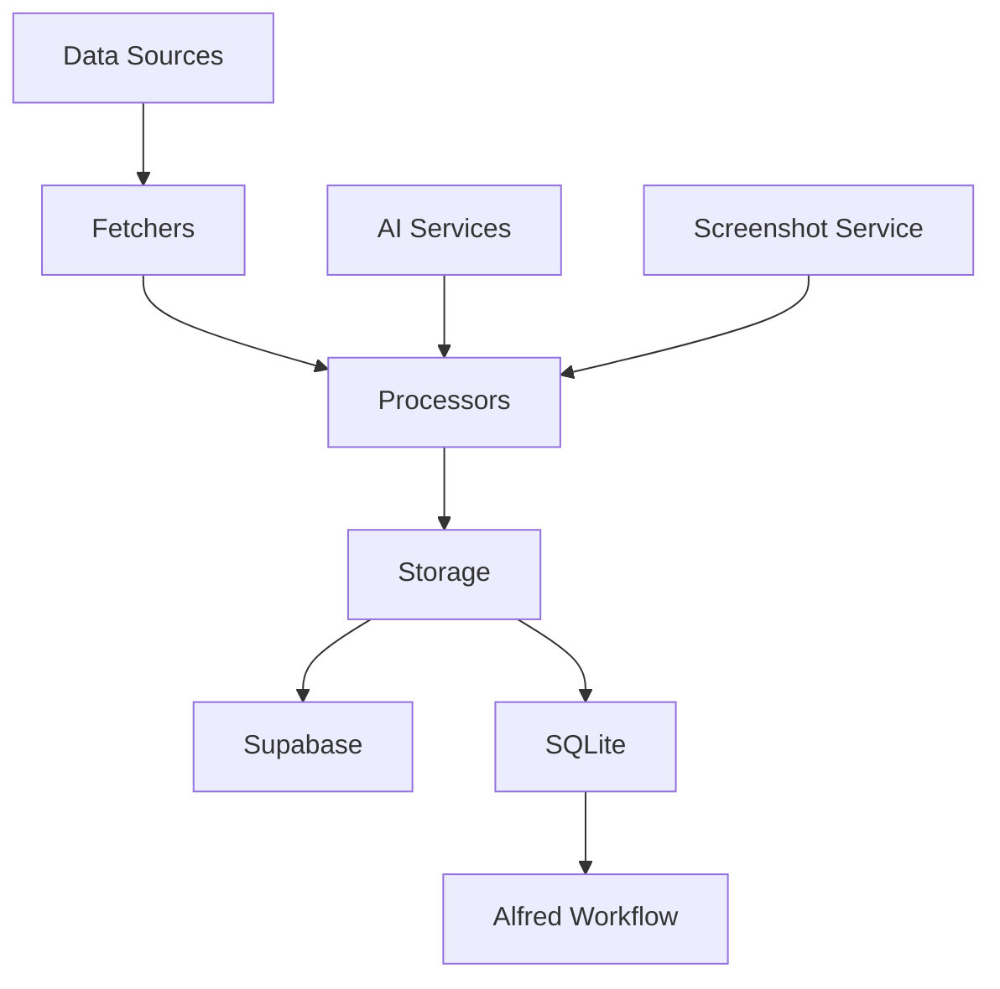

# Scrapbook Core

Scrapbook Core is a comprehensive data management system designed to accumulate and analyze digital ephemera from various sources. It serves as a personal knowledge management tool, capturing and organizing daily digital interactions across multiple platforms.


## Features

- Fetches data from multiple sources:
  - Pinboard bookmarks
  - Mastodon posts
  - GitHub activities (stars, issues, pull requests, gists)
  - Are.na blocks and channels
- Processes and stores data as "scraps" with unique IDs
- Generates summaries and extracts entities for easy retrieval
- Uploads screenshots to Supabase or Cloudinary and stores URLs
- Syncs data with both Supabase and SQLite databases
- Includes an Alfred Workflow for quick local database searches

Can be accessed through the command-line [scrapbook-cli](https://github.com/ejfox/scrapbook-cli) tool.

Also visible on [my website's scrapbook](https://ejfox.com/scrapbook/)

I also use it in combination with an Alfred Workflow and a local SQLite database for quick searching:
- <scripts/setup_sqlite.mjs>
- <scripts/sync_supabase_to_sqlite.js>
- <scripts/search_sqlite_scraps.js>
- <Local\ Scrap\ Search.1.1.alfredworkflow.zip>

## Deploying
`flyctl deploy`

### Running
`flyctl ssh console -C "node scripts/index.mjs --all"`

### Get logs
`flyctl logs`

## Database Schema

### Scraps table
```sql
create table
  public.scraps (
    id uuid not null default gen_random_uuid (),
    source public.scrap_source not null,
    content text not null,
    summary text null,
    created_at timestamp without time zone null default current_timestamp,
    updated_at timestamp without time zone null default current_timestamp,
    tags text null,
    relationships jsonb null,
    metadata jsonb null,
    scrap_id text null,
    embedding public.vector null,
    title text null,
    graph_imported boolean null default false,
    constraint scraps_pkey primary key (id),
    constraint scraps_id_key unique (id),
    constraint scraps_scrap_id_key unique (scrap_id)
  ) tablespace pg_default;
  ```


## System Architecture



## Key Components

1. **Data Fetchers**: Modules for each data source (e.g., `dl_pinboard.mjs`, `dl_mastodon.mjs`)
2. **Processors**: 
   - `aiSummarization.js`: Generates summaries and tags
   - `aiGeolocation.mjs`: Extracts location data
   - `aiRelationshipExtraction.mjs`: Identifies relationships between scraps
3. **Storage**:
   - `index.mjs`: Main script for Supabase operations
   - `sync_supabase_to_sqlite.js`: Syncs data to local SQLite database
4. **Utilities**:
   - `helpers.js`: Common helper functions
   - `manifestHelpers.mjs`: Manages data fetch manifests
5. **Alfred Workflow**: Enables quick searching of the local SQLite database

## Files

- `index.mjs`: The main entry point of the application. It orchestrates the fetching, processing, and storage of data from all sources.
- `sync_supabase_to_sqlite.js`: Synchronizes data between Supabase and a local SQLite database.
- `aiSummarization.js`: Contains functions for summarizing content and generating tags using AI.
- `dl_pinboard.mjs`: Handles fetching and processing of Pinboard bookmarks.
- `dl_mastodon.mjs`: Manages the retrieval of Mastodon statuses.
- `dl_arena.mjs`: Fetches and processes Are.na blocks and channels.
- `dl_github.mjs`: Retrieves GitHub-related data (stars, issues, PRs, gists).
- `aiGeolocation.mjs`: Extracts location information from content.
- `aiRelationshipExtraction.mjs`: Identifies relationships between different pieces of content.
- `helpers.js`: Contains utility functions used across the project.
- `manifestHelpers.mjs`: Manages the manifest file for tracking data fetch operations.
- `alfred_search.js`: Script used by the Alfred Workflow to search the local SQLite database.
- `Scrapbook Search.alfredworkflow`: Alfred Workflow for quick searching of scraps (included as a zip file).

## Setup

1. Clone the repository
2. Install dependencies: `npm install`
3. Set up environment variables in a `.env` file:
   ```
   SUPABASE_URL=your_supabase_url
   SUPABASE_KEY=your_supabase_key
   PINBOARD_TOKEN=your_pinboard_token
   SUPABASE_BUCKET=your_supabase_bucket
   CLOUDINARY_FOLDER=your_cloudinary_folder
   ```
4. Run the main script: `node index.mjs`
5. Install the Alfred Workflow:
   - Unzip the `Local Scrap Search.1.1.alfredworkflow.zip` file
   - Double-click the extracted file to import it into Alfred

## Usage

- Fetch all data: `node index.mjs --all`
- Fetch specific sources:
  - Pinboard: `node index.mjs --pinboard`
  - Mastodon: `node index.mjs --mastodon`
  - Are.na: `node index.mjs --arena`
  - GitHub: `node index.mjs --github`
- Sync to SQLite: `node sync_supabase_to_sqlite.js`
- Search scraps using Alfred:
  - Activate Alfred
  - Type the keyword (default: `sc`) followed by your search query

## Data Flow

1. Data is fetched from various sources
2. Each item is processed:
   - Summaries are generated
   - Locations and relationships are extracted
   - Screenshots are created (for applicable sources)
3. Processed data is upserted into Supabase
4. Data can be synced to a local SQLite database for offline access
5. The local SQLite database can be searched quickly using the Alfred Workflow

## Alfred Workflow

The included Alfred Workflow allows for quick searching of the local SQLite database. It uses the `alfred_search.js` script to perform searches and format results. The workflow provides the following features:

- Fast full-text search of scraps
- Display of relevant information including title, summary, and age of the scrap
- Quick actions:
  - Press Enter to open the scrap's URL
  - Press ⌥ (Option) to view full content
  - Press ⌘ (Command) to copy a formatted version of the scrap

## Setting Up Credentials

### GitHub
1. Go to [GitHub Personal Access Tokens](https://github.com/settings/tokens)
2. Click "Generate new token (classic)"
3. Give it a name like "Scrapbook Core"
4. Select these scopes:
   - `repo` (for repository access)
   - `read:user` (for profile info)
   - `gist` (for gist access)
5. Copy the token and add to your .env:
```bash
GITHUB_TOKEN=github_pat_...
GITHUB_USERNAME=your_username
```

### Pinboard
1. Get your API token from [Pinboard Settings](https://pinboard.in/settings/password)
2. Add to .env:
```bash
PINBOARD_TOKEN=user:hash
```

### Are.na
1. Create token at [Are.na Developer Settings](https://dev.are.na/oauth/applications)
2. Add to .env:
```bash
ARENA_ACCESS_TOKEN=your_token
USER_SLUG=your_username
```

### Mastodon
1. Go to your instance's developer settings
2. Create new application
3. Add to .env:
```bash
MASTODON_ACCESS_TOKEN=your_token
MASTODON_API_URL=https://your.instance
```

### Supabase
1. Get credentials from your Supabase project settings
2. Add to .env:
```bash
SUPABASE_URL=your_project_url
SUPABASE_KEY=your_anon_key
```

### OpenCage Data (for Geolocation)
1. Go to [OpenCage Data](https://opencagedata.com/)
2. Sign up for a free account
3. Create an API key from your dashboard
4. Add to .env:
```bash
OPENCAGE_API_KEY=your_api_key
```

Note: The free tier includes:
- 2,500 requests per day
- 1 request per second rate limit
- HTTPS encryption
- Full global coverage

Your final `.env` file should look like:
```bash
# GitHub
GITHUB_TOKEN=github_pat_...
GITHUB_USERNAME=your_username

# Pinboard
PINBOARD_TOKEN=user:hash

# Are.na
ARENA_ACCESS_TOKEN=your_token
USER_SLUG=your_username

# Mastodon
MASTODON_ACCESS_TOKEN=your_token
MASTODON_API_URL=https://your.instance

# Supabase
SUPABASE_URL=your_project_url
SUPABASE_KEY=your_anon_key

# OpenCage Data
OPENCAGE_API_KEY=your_opencage_api_key
```

## Set Fly Secrets Quickly
```
cat .env | grep -v '^#' | grep -v '^$' | while read -r line; do
  echo "Setting $line..."
  flyctl secrets set "$line"
done
```

## Validation Tools

The project includes two powerful validation utilities for testing data integrity and AI functionality.

### Scrap Validation (`validate_scraps.mjs`)

A comprehensive validation tool for testing data fetching and processing from all sources.

```bash
# Validate all sources
node scripts/validate_scraps.mjs

# Validate specific source
node scripts/validate_scraps.mjs pinboard
node scripts/validate_scraps.mjs mastodon
node scripts/validate_scraps.mjs arena
node scripts/validate_scraps.mjs github
```

Features:
- Validates data structure and required fields
- Checks data types and formats
- Source-specific validation rules
- Screenshot validation where applicable
- Performance benchmarking
- Detailed error reporting
- Sample data display

Example output:
```
==================================
   SCRAPBOOK VALIDATION UTILITY   
==================================

[CHECKING REQUIRED FIELDS]
  id           [OK]
  source       [OK]
  type         [OK]
  url          [OK]
  title        [OK]
  content      [OK]
  ...

Validation Summary:
PASS pinboard: 5 scraps, 0 errors, 0 warnings (1234.56ms)
```

### AI Service Validation (`validate_ai.mjs`)

Tests all AI-powered features with sample content to ensure proper functionality.

```bash
# Run all AI service tests
node scripts/validate_ai.mjs

# Test specific services
node scripts/validate_ai.mjs summarization
node scripts/validate_ai.mjs location
node scripts/validate_ai.mjs relationships
node scripts/validate_ai.mjs github
node scripts/validate_ai.mjs mastodon
```

Available services:
- `summarization`: Tests content summarization and tag generation
- `location`: Tests geographic location extraction
- `relationships`: Tests entity relationship detection
- `github`: Tests GitHub activity analysis
- `mastodon`: Tests Mastodon content processing

Features:
- Uses cached test data
- Tests multiple prompts
- Shows input/output samples
- Performance metrics
- Error handling verification
- Model fallback testing
- Individual service testing
- Detailed logging

Example output:
```
╔═══════════════════════════════════════╗
║         AI VALIDATION UTILITY         ║
║  ‾‾‾‾‾‾‾‾‾‾‾‾‾‾‾‾‾‾‾‾‾‾‾‾‾‾‾‾‾‾‾‾‾  ║
║    [STATUS: INITIALIZING TESTS]       ║
╚═══════════════════════════════════════╝

[TESTING SUMMARIZATION]
Summary: ...
Tags: technology, javascript, web-development

Validation Summary:
summarization    PASS              
Duration:        1234.56ms        
```

### Development Workflow

1. Run `validate_scraps.mjs` after:
   - Modifying data fetchers
   - Updating processing logic
   - Changing data structures
   - Adding new sources

2. Run `validate_ai.mjs` after:
   - Updating AI prompts
   - Changing model settings
   - Modifying AI processing
   - Switching LLM providers

3. Both scripts support:
   - Debug mode: `DEBUG=true node scripts/validate_*.mjs`
   - Test mode: Uses smaller data samples
   - Benchmarking: Timing for each operation
   - Detailed logging: Check `logs/` directory

### Validation Configuration

The validation tools use several environment variables:
```bash
# General
DEBUG=true|false           # Enable detailed logging
TEST_MODE=true|false      # Use smaller data samples

# LLM Service
USE_LOCAL_LLM=true|false  # Use local LLaMA model
USE_OPENAI=true|false     # Use OpenAI
OPENROUTER_API_KEY=xxx    # OpenRouter API key
```

### Adding New Validations

1. Add source config in `validate_scraps.mjs`:
```javascript
const SOURCE_CONFIG = {
  new_source: {
    requiresScreenshot: boolean,
    validTypes: ['type1', 'type2']
  }
};
```

2. Add AI test in `validate_ai.mjs`:
```javascript
// Add test sample
const TEST_SAMPLES = {
  new_test: {
    // test data
  }
};

// Add test case
try {
  console.log('[TESTING NEW FEATURE]');
  const result = await newFeature(TEST_SAMPLES.new_test);
  results.new_feature = { success: true };
} catch (error) {
  results.new_feature = { success: false, error };
}
```

## Scrap Processing & Claiming System

### Overview
The system uses a database-level claiming mechanism to prevent duplicate processing when running multiple instances (e.g., on fly.io). This ensures that even with multiple instances running simultaneously, each scrap is only processed once.

### How It Works

1. **Instance Identification**
   ```js
   const INSTANCE_NAME = process.env.INSTANCE_NAME || 
     `${process.env.NODE_ENV || 'dev'}-${os.hostname()}-${Date.now()}`;
   ```
   Each instance gets a unique identifier combining:
   - Environment (dev/prod)
   - Hostname
   - Timestamp
   
2. **Claiming Process**
   ```sql
   -- Example claim attempt
   UPDATE scraps
   SET 
     processing_instance_id = 'instance-123',
     processing_started_at = NOW()
   WHERE 
     scrap_id = 'source-456'
     AND processing_instance_id IS NULL
   RETURNING *;
   ```
   - Atomic database operation
   - Only succeeds if scrap isn't claimed
   - Includes timestamp for stuck detection

3. **Stuck Protection**
   ```js
   const STUCK_THRESHOLD_MINS = 5;
   ```
   - Claims expire after 5 minutes
   - Automatic cleanup of orphaned claims
   - Periodic check for stuck processing

4. **Source-specific IDs**
   Each source uses a consistent prefix:
   - `pinboard-{hash}`
   - `mastodon-{id}`
   - `arena-{id}`
   - `github-{id}`

### Database Schema
```sql
-- Claiming system columns
processing_instance_id text null,
processing_started_at timestamp without time zone null,

-- Index for efficient claiming queries
create index if not exists processing_status_idx on public.scraps 
using btree (processing_instance_id, processing_started_at);
```

### Running on Fly.io

1. **Set Instance Name**
   ```bash
   # In fly.toml
   [env]
   INSTANCE_NAME = "fly-{{.Region}}-{{.AppName}}-{{.ID}}"
   ```

2. **Scale Instances**
   ```bash
   # Scale to multiple regions
   flyctl scale count 3
   ```

3. **Monitor Processing**
   ```bash
   # Check processing status
   flyctl logs --include-app 'processing_instance_id|processing_started_at'
   ```

4. **Clear Stuck Claims**
   ```bash
   # Manual cleanup if needed
   flyctl ssh console -C "node scripts/validate_db_integrity.mjs"
   ```

### Best Practices

1. **Always Use Try/Finally**
   ```js
   try {
     // Attempt to claim
     if (await claimScrap(scrapId)) {
       try {
         // Process scrap
       } finally {
         // Always release claim
         await releaseScrap(scrapId);
       }
     }
   } catch (error) {
     // Handle error & ensure claim is released
     await releaseScrap(scrapId);
   }
   ```

2. **Regular Cleanup**
   - Run `clearStuckProcessing()` on startup
   - Set up periodic cleanup for long-running instances
   - Use `validate_db_integrity.mjs` for manual checks

3. **Monitoring**
   - Watch for stuck claims in logs
   - Monitor processing durations
   - Set up alerts for repeated claim failures

4. **Error Handling**
   - Always release claims in error cases
   - Log claim/release failures
   - Implement retry logic for transient failures

### Troubleshooting

1. **Stuck Claims**
   ```bash
   # Find stuck claims
   SELECT scrap_id, processing_instance_id, processing_started_at 
   FROM scraps 
   WHERE processing_instance_id IS NOT NULL
   AND processing_started_at < NOW() - INTERVAL '5 minutes';
   ```

2. **Clear All Claims**
   ```bash
   # Emergency reset
   UPDATE scraps 
   SET processing_instance_id = NULL, 
       processing_started_at = NULL;
   ```

3. **Monitor Instance Activity**
   ```bash
   # Check active instances
   SELECT DISTINCT processing_instance_id 
   FROM scraps 
   WHERE processing_started_at > NOW() - INTERVAL '5 minutes';
   ```

### Validation

The `validate_db_integrity.mjs` script includes checks for:
- Stuck processing detection
- Invalid claim states
- Processing duration anomalies
- Instance name validation
- Claim release verification

Run it regularly to ensure system health:
```bash
node scripts/validate_db_integrity.mjs
```