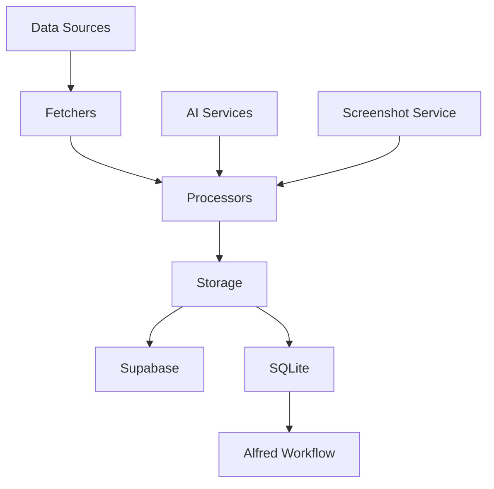
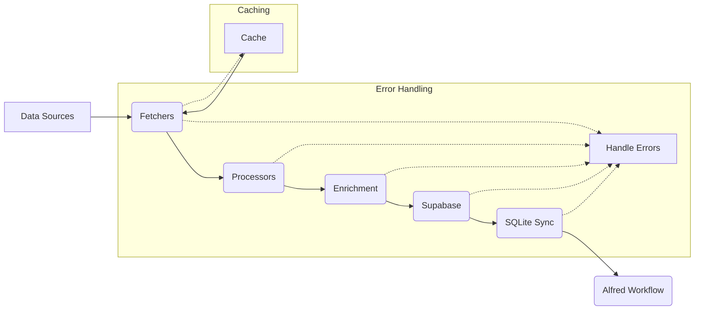
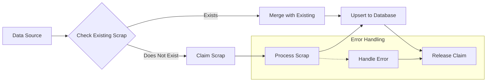

# Scrapbook Core

**Scrapbook Core** is an automated personal knowledge management system that turns your digital life into a searchable archive. It continuously collects your activities from platforms like GitHub, Mastodon, Pinboard, and Are.na, then uses AI to generate summaries, extract relationships, and create searchable "scraps" of knowledge.

## What it does in simple terms:
- **Collects**: Automatically pulls your bookmarks, social posts, code activity, and saved content
- **Processes**: Uses AI to summarize content, extract key information, and find connections  
- **Organizes**: Stores everything in a searchable database with tags, summaries, and relationships
- **Accesses**: Provides instant search via Alfred workflow and web interface

Think of it as an automated digital memory that captures what you read, create, and share online, then makes it easily findable later.


## Modular Packages 📦

Scrapbook Core's AI analysis tools are available as **standalone packages** that you can use in your own projects:

- **[@scrapbook/entity-extraction](./packages/entity-extraction)** - Extract entities and relationships from text
- **[@scrapbook/content-summarization](./packages/content-summarization)** - AI-powered content summarization
- **[@scrapbook/content-geolocation](./packages/content-geolocation)** - Extract and geocode locations
- **[@scrapbook/financial-analysis](./packages/financial-analysis)** - Financial entity and sentiment extraction

Each package is LLM-agnostic and can work with OpenAI, Anthropic, OpenRouter, or any other provider. See the [packages directory](./packages) for detailed documentation.

## Features

- Fetches data from multiple sources:
  - Pinboard bookmarks
  - Mastodon posts
  - GitHub activities (stars, issues, pull requests, gists)
  - Are.na blocks and channels
- Processes and stores data as "scraps" with unique IDs
- Generates summaries and extracts entities for easy retrieval
- Uploads screenshots to Supabase or Cloudinary and stores URLs
- Stores canonical data in Supabase and supports local SQLite search workflows
- Includes an Alfred Workflow for quick local database searches
- **Realtime dashboard** with live activity feed and auto-advance
- **Smart rate limiting** with automatic free model fallbacks
- **Cost safety systems** with circuit breakers and spending limits
- **Enhanced AI extraction** with OpenAI fallback and improved reliability

## Recent Improvements

### Realtime Dashboard (v1.2.0)
- **Live Activity Ticker**: See updates as they happen with a scrolling news ticker
- **Auto-advance**: Automatically shows newly processed scraps
- **Connection Status**: Visual indicator for Supabase realtime connection
- **Pulse Animations**: Recently updated scraps pulse for 3 seconds
- Enable realtime in Supabase: Database → Replication → `scraps` table

### AI Service Reliability
- **Multi-provider Fallback**: Automatically falls back to OpenAI when OpenRouter fails
- **Smart Rate Limiting**: Progressive backoff (6 levels) with automatic recovery
- **Better JSON Extraction**: Handles markdown code blocks and truncated responses
- **Content Validation**: Skips AI processing for insufficient content (< 50 chars)

### Enhanced Data Extraction
- **Location with Coordinates**: OpenCage geocoding provides lat/lon for all locations
- **Relationship Quality**: 50+ entity type patterns for better relationship extraction
- **Financial Analysis**: Tracks 40+ assets with sentiment analysis
- **Gemini Vision**: Transforms image embeddings into rich visual descriptions

### Process Reliability
- **No More Zombies**: Scripts properly exit after completion (10-minute timeout)
- **Fail-Fast**: Errors in critical extractions (summary/tags) stop processing immediately
- **Comprehensive Logging**: Detailed error tracking and debugging information

### Testing & Quality
- **Test Suite**: Comprehensive validation for AI services, data integrity, and embeddings
- **Quality Auditing**: Field completeness checks and data validation tools
- **Webhook Alerting**: Smart degradation detection for production monitoring

## Quick VPS Deployment

Deploy Scrapbook Core on any VPS in just a few commands using Docker.

### Option 1: Automated Deployment Script

```bash
# Clone and deploy
git clone https://github.com/ejfox/scrapbook-core.git
cd scrapbook-core

# Copy environment template
cp .env.production.example .env
nano .env  # Add your API keys

# Deploy with one command
./deploy.sh
```

### Option 2: Using Make

```bash
# Quick setup and deployment
make setup
make deploy

# View logs and status
make logs
make status
```

### Option 3: Manual Docker Compose

```bash
# Set up environment
cp .env.production.example .env
nano .env

# Deploy
docker-compose up -d
docker-compose logs -f
```

## Scheduling Options

### Built-in Docker Scheduling
The container runs the scraper by default. For scheduled runs:

```bash
# Run every 4 hours via cron
0 */4 * * * cd /path/to/scrapbook-core && docker-compose run --rm scrapbook-core

# Or use the deployment script
0 */4 * * * cd /path/to/scrapbook-core && ./deploy.sh --update
```

### Manual Execution
```bash
# Run specific sources
docker-compose exec scrapbook-core node scripts/index.mjs --pinboard --new-only

# Run all sources
docker-compose exec scrapbook-core node scripts/index.mjs --all
```

## Deployment Features

- **Zero-downtime updates**: `./deploy.sh --update`
- **Health monitoring**: Built-in Docker health checks
- **Log rotation**: Automatic log management
- **Resource limits**: Configurable memory and CPU limits
- **Persistent data**: Volumes for data, logs, and screenshots

📖 **For detailed deployment instructions, troubleshooting, and advanced configuration, see [DEPLOYMENT.md](DEPLOYMENT.md)**

**Maintenance Commands:**
- Update: `git pull && docker-compose up -d --build`
- Stop: `docker-compose down`
- View logs: `docker-compose logs -f`
- Check status: `docker-compose ps`

## System Requirements

Based on Docker testing with 10 concurrent instances:

- **RAM**: 1GB minimum (single instance uses ~5MB active, ~520KB idle)
- **CPU**: 1 vCPU (brief spikes during processing and screenshot generation)  
- **Storage**: 2GB+ for Docker image and data
- **Network**: Stable internet connection

Memory usage scales linearly (~520KB per additional idle instance).

## Environment Setup

1. Copy the example environment file:
```bash
cp .env.example .env
```

2. Fill in your credentials in `.env`:
```bash
# Required API Keys
GITHUB_TOKEN=your_github_token
PINBOARD_TOKEN=your_pinboard_token
ARENA_ACCESS_TOKEN=your_arena_token
MASTODON_ACCESS_TOKEN=your_mastodon_token

# Database Configuration
SUPABASE_URL=your_supabase_url
SUPABASE_KEY=your_supabase_key
SUPABASE_SERVICE_ROLE_KEY=your_service_role_key

# Image Storage (Cloudinary)
CLOUDINARY_CLOUD_NAME=your_cloud_name
CLOUDINARY_API_KEY=your_api_key
CLOUDINARY_API_SECRET=your_api_secret

# AI Services
OPENROUTER_API_KEY=your_openrouter_key
NOMIC_API_KEY=your_nomic_key

# Optional Configuration
DEBUG=false
INSTANCE_NAME=local-dev
```

3. Test your configuration:
```bash
npm run validate:env
```

## Local Development

1. Clone the repository:
```bash
git clone https://github.com/yourusername/scrapbook-core.git
cd scrapbook-core
```

2. Install dependencies:
```bash
npm install
```

3. Set up environment variables (see Environment Setup above)

4. Run the processor locally:
```bash
npm run dev
```

5. Run package smoke tests:
```bash
npm test
```

6. Run the dashboard UI:
```bash
npm run dashboard:dev
```

## Usage

### Data Collection
- Fetch all data: `npm run fetch:all`
- Fetch specific sources: `npm run fetch:pinboard`, `npm run fetch:github`, etc.
- Local SQLite search helper: `node scripts/search_sqlite_scraps.js "query"`

### Data Quality & Maintenance
- Check scrapbook health: `npm run doctor:status`
- Detailed analysis: `npm run doctor:diagnose`
- Repair missing fields: `npm run doctor:repair`

### Interfaces
- **Realtime Dashboard**: `cd dashboard && npm run dev` (opens http://localhost:3002)
  - Live activity ticker showing INSERT/UPDATE events
  - Auto-advances to newly processed scraps
  - Connection status indicator (requires Supabase Realtime enabled)
  - Keyboard navigation (← / →)
- **Alfred Workflow**: Quick search with keyword `sc`
- **TUI Interface**: Use [scrapbook-cli](https://github.com/ejfox/scrapbook-cli) for terminal interface

Can be accessed through the command-line [scrapbook-cli](https://github.com/ejfox/scrapbook-cli) tool.

Also visible on [my website's scrapbook](https://ejfox.com/scrapbook/)

I also use it in combination with an Alfred Workflow and a local SQLite database for quick searching:
- `scripts/search_sqlite_scraps.js`
- `Local Scrap Search.1.1.alfredworkflow.zip`

SQLite sync tooling is not currently bundled in this checkout.

### Maintenance Commands

The following commands help maintain the database by fixing or removing problematic scraps:

#### Cleaning Commands
- Delete scraps with missing data: `node scripts/index.mjs --clean`
- Delete only completely empty scraps: `node scripts/index.mjs --clean-empty`
- Delete scraps missing some fields: `node scripts/index.mjs --clean-partial`
- Preview what would be deleted: `node scripts/index.mjs --clean-dry-run`

#### Fixing Commands
- Fix missing data in scraps: `node scripts/index.mjs --fix`
- Preview what would be fixed: `node scripts/index.mjs --fix-dry-run`
- Fix specific issues:
  - Missing images: `node scripts/index.mjs --fix-images`
  - Missing embeddings: `node scripts/index.mjs --fix-embeddings`
  - Missing AI data: `node scripts/index.mjs --fix-ai`
- Fix specific sources:
  - Pinboard: `node scripts/index.mjs --fix-pinboard`
  - Are.na: `node scripts/index.mjs --fix-arena`
  - Mastodon: `node scripts/index.mjs --fix-mastodon`

All cleaning and fixing commands will:
1. Show you what will be affected before making changes
2. Display a breakdown by source
3. Show example scraps that will be modified
4. Ask for confirmation before proceeding

## System Architecture



## Key Components

1. **Data Fetchers**: Modules for each data source (e.g., `dl_pinboard.mjs`, `dl_mastodon.mjs`). These modules handle the retrieval of data from external APIs.
2. **Processors**: Modules that process the raw data from the fetchers. This includes:
   - `aiSummarization.js`: Generates summaries and tags using AI.
   - `aiGeolocation.mjs`: Extracts location data from text content.
   - `aiRelationshipExtraction.mjs`: Identifies relationships between different scraps.
3. **Storage**: Handles persistence of processed data.
   - `index.mjs`: The main script orchestrating data fetching, processing, and storage in Supabase.
   - Local SQLite search is supported, but sync tooling is currently maintained separately from this checkout.
4. **Utilities**: Helper functions and modules.
   - `helpers.js`: Common utility functions.
   - `manifestHelpers.mjs`: Manages a manifest file for tracking data fetch operations.
5. **Alfred Workflow**: Enables quick searching of the local SQLite database.

## Database Schema

### Scraps table
```sql
CREATE TABLE public.scraps (
    id UUID NOT NULL DEFAULT gen_random_uuid(),
    source TEXT NOT NULL,
    content TEXT NOT NULL,
    summary TEXT NULL,
    created_at TIMESTAMP WITHOUT TIME ZONE NULL DEFAULT CURRENT_TIMESTAMP,
    updated_at TIMESTAMP WITHOUT TIME ZONE NULL DEFAULT CURRENT_TIMESTAMP,
    tags TEXT[],
    relationships JSONB NULL,
    metadata JSONB NULL,
    scrap_id TEXT NULL,
    embedding VECTOR NULL,
    title TEXT NULL,
    graph_imported BOOLEAN NULL DEFAULT FALSE,
    url TEXT NULL,
    screenshot_url TEXT NULL,
    location TEXT NULL,
    latitude FLOAT NULL,
    longitude FLOAT NULL,
    published_at TIMESTAMP NULL,
    shared BOOLEAN DEFAULT FALSE,
    CONSTRAINT scraps_pkey PRIMARY KEY (id),
    CONSTRAINT scraps_id_key UNIQUE (id),
    CONSTRAINT scraps_scrap_id_key UNIQUE (scrap_id)
);
```

## Complete Scrap Data Structure (For Unity/Game Development)

Each scrap contains the following properties accessible via API:

### Core Identifiers
```json
{
  "id": "uuid-v4",                    // Database UUID
  "scrap_id": "source-hash",          // Unique ID format: "pinboard-abc123"
  "source": "pinboard|github|mastodon|arena"  // Data source
}
```

### Content & Metadata
```json
{
  "title": "Page/item title",
  "content": "Full text content",      // Raw content from source
  "summary": "AI-generated summary",  // 2-3 sentence summary
  "url": "https://...",              // Original URL
  "screenshot_url": "https://...",   // Screenshot image URL
}
```

### Timestamps
```json
{
  "created_at": "2025-01-01T12:00:00Z",   // When scraped
  "updated_at": "2025-01-01T12:00:00Z",   // Last updated
  "published_at": "2024-12-31T10:00:00Z"  // Original publish date
}
```

### AI-Extracted Data
```json
{
  "tags": ["tag1", "tag2", "tag3"],          // AI-generated topical tags
  "relationships": {                          // Connections to other scraps
    "mentions": ["scrap_id_1", "scrap_id_2"],
    "topics": ["topic1", "topic2"],
    "people": ["person1", "person2"]
  },
  "embedding": [0.1, 0.2, -0.3, ...],       // 1536-dim vector for similarity
}
```

### Location Data
```json
{
  "location": "City, Country",        // Human-readable location
  "latitude": 40.7128,               // GPS coordinates
  "longitude": -74.0060,
}
```

### Source-Specific Metadata
The `metadata` field contains source-specific information:

#### Pinboard Bookmarks
```json
{
  "metadata": {
    "description": "Original bookmark description",
    "tags": ["original", "pinboard", "tags"],
    "private": false,
    "toread": false
  }
}
```

#### GitHub Items
```json
{
  "metadata": {
    "stargazers_count": 1234,
    "forks_count": 56,
    "language": "JavaScript", 
    "topics": ["web", "frontend"],
    "is_fork": false,
    "default_branch": "main"
  }
}
```

#### Mastodon Posts
```json
{
  "metadata": {
    "replies_count": 5,
    "reblogs_count": 12,
    "favourites_count": 34,
    "visibility": "public",
    "language": "en"
  }
}
```

#### Are.na Blocks
```json
{
  "metadata": {
    "block_type": "text|image|link",
    "connections": 5,
    "channels": ["channel-name-1", "channel-name-2"]
  }
}
```

### Financial Data Extraction
When financial information is detected, additional fields may be present:
```json
{
  "metadata": {
    "financial_assets": [
      {
        "type": "stock",
        "symbol": "AAPL", 
        "mentioned_price": "$150.00",
        "context": "Apple stock hit $150"
      }
    ],
    "financial_amounts": [
      {
        "amount": 1000000,
        "currency": "USD",
        "context": "$1M funding round"
      }
    ]
  }
}
```

### API Access Patterns

#### Get All Scraps
```http
GET /api/scraps?limit=100&offset=0
GET /api/scraps?source=pinboard
GET /api/scraps?tags=contains(technology)
```

#### Search by Content  
```http
GET /api/scraps?search=machine learning
POST /api/scraps/semantic_search
{
  "query": "AI and robotics",
  "limit": 10,
  "similarity_threshold": 0.8
}
```

#### Get by Location
```http
GET /api/scraps?has_location=true
GET /api/scraps?near_lat=40.7128&near_lng=-74.0060&radius_km=10
```

#### Filter by Date Range
```http
GET /api/scraps?created_after=2024-01-01&created_before=2024-12-31
GET /api/scraps?published_after=2024-06-01
```

## Data Flow



1. Data is fetched from various sources.
2. Each item is processed: summaries are generated, locations and relationships are extracted, and screenshots are created (where applicable).
3. Processed data is upserted into Supabase.
4. Data is synced to a local SQLite database for offline access.
5. The local SQLite database can be searched quickly using the Alfred Workflow.

## Claiming and Processing Flow



## Alfred Workflow

The Alfred Workflow enables quick searching of the local SQLite database. It displays title, summary, and age, with quick actions to open URLs, view full content, or copy formatted scraps.

## Setting Up Credentials

This project requires several API keys and secrets. Store these securely in a `.env` file *in your local repository only*. **Do not commit your `.env` file to version control.** Use the `.env-example` file as a template.

| Environment Variable        | Description                                                                     | Source                                                                          |
|-----------------------------|---------------------------------------------------------------------------------|-----------------------------------------------------------------------------------|
| `GITHUB_TOKEN`              | GitHub Personal Access Token (repo, read:user, gist scopes)                     | [GitHub Personal Access Tokens](https://github.com/settings/tokens)                 |
| `GITHUB_USERNAME`           | Your GitHub username                                                              |                                                                                   |
| `PINBOARD_TOKEN`            | Your Pinboard API token                                                            | [Pinboard Settings](https://pinboard.in/settings/password)                         |
| `ARENA_ACCESS_TOKEN`        | Your Are.na API token                                                             | [Are.na Developer Settings](https://dev.are.na/oauth/applications)                 |
| `USER_SLUG`                 | Your Are.na username                                                              |                                                                                   |
| `MASTODON_ACCESS_TOKEN`     | Your Mastodon API token                                                            | Your Mastodon instance's developer settings                                        |
| `MASTODON_API_URL`          | Your Mastodon instance URL (e.g., `https://mastodon.social`)                     | Your Mastodon instance's developer settings                                        |
| `SUPABASE_URL`              | Your Supabase project URL                                                         | Your Supabase project settings                                                    |
| `SUPABASE_KEY`              | Your Supabase anon key                                                            | Your Supabase project settings                                                    |
| `SUPABASE_SERVICE_ROLE_KEY` | Your Supabase service role key (required for database operations)               | Your Supabase project settings                                                    |
| `CLOUDINARY_CLOUD_NAME`     | Your Cloudinary cloud name                                                        | Your Cloudinary account settings                                                  |
| `CLOUDINARY_API_KEY`        | Your Cloudinary API key                                                           | Your Cloudinary account settings                                                  |
| `CLOUDINARY_API_SECRET`     | Your Cloudinary API secret                                                       | Your Cloudinary account settings                                                  |
| `OPENROUTER_API_KEY`        | OpenRouter API key (for AI summarization)                                      | OpenRouter account settings                                                       |
| `OPENCAGE_API_KEY`          | OpenCage Geocoding API key (for location extraction)                             | [OpenCage Data](https://opencagedata.com/)                                      |

## Validation Tools

The project includes validation utilities:

### Scrap Validation (`validate_scraps.mjs`)
This script validates the structure and content of scraped data, checking for missing fields, incorrect data types, and invalid formats. Run it with `node tests/validate_scraps.mjs [source]`.

### AI Service Validation (`validate_ai.mjs`)
This script tests the AI-powered features (summarization, geolocation, relationship extraction) using sample data. Run it with `node tests/validate_ai.mjs [test_name]`.

### Database Maintenance
Regularly run `node tests/validate_db_integrity.mjs` to check for and clean up any orphaned or stuck processing records.

## Smart Rate Limiting and Caching

### Intelligent 429 Handling
The application features **SmartRateLimiter** that automatically handles API rate limit errors (429 responses):

**Progressive Backoff Levels:**
1. **Normal**: Default API rate limits
2. **Cautious**: 2x slower, reduced concurrency  
3. **Conservative**: 4x slower, single requests only
4. **Free Model**: Falls back to free model rate limits (3+ second delays)
5. **Super Polite**: Double free model delays
6. **Glacial**: 10+ second delays for extreme cases

**Automatic Recovery:**
- Escalates to more conservative levels after 3 consecutive 429s
- Automatically recovers to faster levels after 10 consecutive successes
- Maintains separate limiters for OpenRouter, OpenAI, and Nomic APIs

**Usage Example:**
```bash
# Test the smart rate limiter
node tests/test-smart-rate-limiter.mjs

# Monitor rate limiter status in logs
DEBUG=true node scripts/index.mjs --pinboard
```

### Caching
Caching is used to reduce API calls and improve performance. The cache is stored locally in the `./data` directory.

## AI Services

The application utilizes AI services for summarization and embedding generation. Currently, OpenAI's `text-embedding-ada-002` model is used for embeddings. The `OPENROUTER_API_KEY` is required for AI summarization.

## Error Handling and Logging

The application includes comprehensive error handling and logging using `winston`. Errors are logged to the console with detailed error messages for troubleshooting.

## Troubleshooting

### Common Issues

1. **Rate Limiting**: If you hit API rate limits, the app will back off automatically. You can adjust rate limits in `scripts/shared/rateLimiters.mjs`.

2. **Database Connection**: If you can't connect to Supabase:
   - Check your environment variables
   - Ensure your IP is whitelisted
   - Verify database permissions

3. **Memory Issues**: If you see out-of-memory errors:
   - Consider reducing batch sizes in the fetchers
   - Check Docker resource limits

### Getting Help

- Check the logs in `logs/` directory
- Run with DEBUG=true for verbose logging
- Open an issue on GitHub

## Contributing

1. Fork the repository
2. Create a feature branch
3. Make your changes
4. Run tests
5. Submit a pull request

Please follow the existing code style and include tests for new features.

## License

MIT License - see LICENSE file for details
